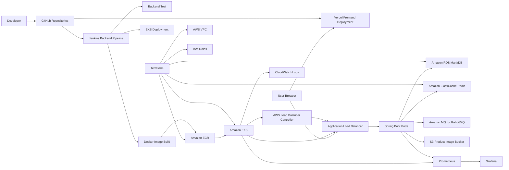

# Deployment Architecture

## Frontend Decision

프론트엔드는 S3 + CloudFront 대신 Vercel을 사용한다.

이유:

- PR 단위 Preview Deployment를 빠르게 만들 수 있다.
- Production deployment와 rollback이 단순하다.
- 프론트 환경변수를 Vercel 환경별로 분리할 수 있다.
- AWS 구성은 EKS, RDS, Redis, ALB, 모니터링 등 백엔드 운영 역량에 집중할 수 있다.

## Backend Decision

백엔드는 EKS에 배포한다.

이유:

- Kubernetes Deployment, Service, Ingress, HPA, ConfigMap, Secret을 포트폴리오에 포함할 수 있다.
- Jenkins, ECR, Terraform과 연결되는 실전형 CI/CD 흐름을 만들 수 있다.
- Prometheus/Grafana로 API latency, JVM, Pod, queue, Redis 지표를 수집할 수 있다.

## Load Balancer Decision

외부 API 트래픽은 AWS Load Balancer Controller가 생성하는 ALB로 받는다.

이유:

- Kubernetes Ingress 변경이 AWS ALB/TargetGroup/HealthCheck 생성으로 이어지는 흐름을 보여줄 수 있다.
- public subnet tag, private Pod target-type ip, Actuator health check를 하나의 배포 아키텍처로 설명할 수 있다.
- 수동 ALB 생성 대비 배포 반복 시간과 설정 누락 위험을 줄였다는 자동화 지표를 만들기 좋다.

## Database Decision

데이터베이스는 Amazon RDS MariaDB를 사용한다.

이유:

- 기존 백엔드가 MariaDB dialect와 JDBC URL을 사용하므로 애플리케이션 변경 폭이 작다.
- private subnet, backup retention, storage encryption, slow query log export를 Terraform으로 설명할 수 있다.
- 로컬 DB 대비 운영 자동화, 장애 대응, 성능 병목 분석 지표를 포트폴리오 수치로 만들기 좋다.

## Cache Decision

Redis는 Amazon ElastiCache Redis를 사용한다.

이유:

- 백엔드가 refresh token 저장, 재고 차감, SSE pub/sub에 Redis를 사용하고 있어 관리형 전환 효과를 직접 측정할 수 있다.
- private subnet, security group, snapshot, slow-log/engine-log export를 Terraform으로 설명할 수 있다.
- 로컬 Redis 대비 API latency, DB 부하 감소, 캐시 장애 시 영향 범위를 부하테스트 지표로 비교하기 좋다.

## Message Queue Decision

RabbitMQ는 EKS 내부 직접 운영 대신 Amazon MQ for RabbitMQ를 사용한다.

이유:

- broker 패치, 장애 복구, 로그 수집 같은 운영 책임을 관리형 서비스로 넘길 수 있다.
- EKS Pod는 AMQPS endpoint로 접근하고, broker는 private subnet과 security group으로 보호한다.
- 직접 운영형 RabbitMQ 대비 운영 시간, 장애 대응 범위, queue backlog, consumer 처리 지연을 비교 지표로 만들기 좋다.
