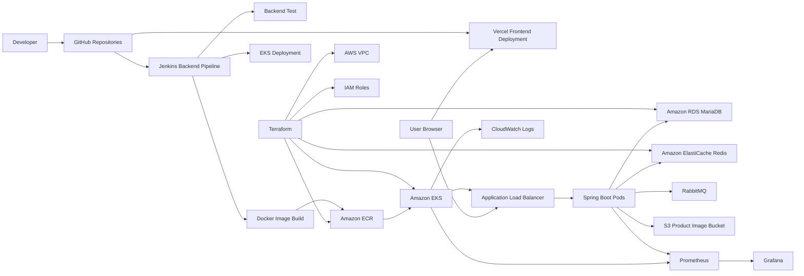

# Deployment Architecture

## Frontend Decision

프론트엔드는 S3 + CloudFront 대신 Vercel을 사용한다.

이유:

- PR 단위 Preview Deployment를 빠르게 만들 수 있다.
- Production deployment와 rollback이 단순하다.
- 프론트 환경변수를 Vercel 환경별로 분리할 수 있다.
- AWS 구성은 EKS, RDS, Redis, ALB, 모니터링 등 백엔드 운영 역량에 집중할 수 있다.

## Backend Decision

백엔드는 EKS에 배포한다.

이유:

- Kubernetes Deployment, Service, Ingress, HPA, ConfigMap, Secret을 포트폴리오에 포함할 수 있다.
- Jenkins, ECR, Terraform과 연결되는 실전형 CI/CD 흐름을 만들 수 있다.
- Prometheus/Grafana로 API latency, JVM, Pod, queue, Redis 지표를 수집할 수 있다.

## Database Decision

데이터베이스는 Amazon RDS MariaDB를 사용한다.

이유:

- 기존 백엔드가 MariaDB dialect와 JDBC URL을 사용하므로 애플리케이션 변경 폭이 작다.
- private subnet, backup retention, storage encryption, slow query log export를 Terraform으로 설명할 수 있다.
- 로컬 DB 대비 운영 자동화, 장애 대응, 성능 병목 분석 지표를 포트폴리오 수치로 만들기 좋다.
